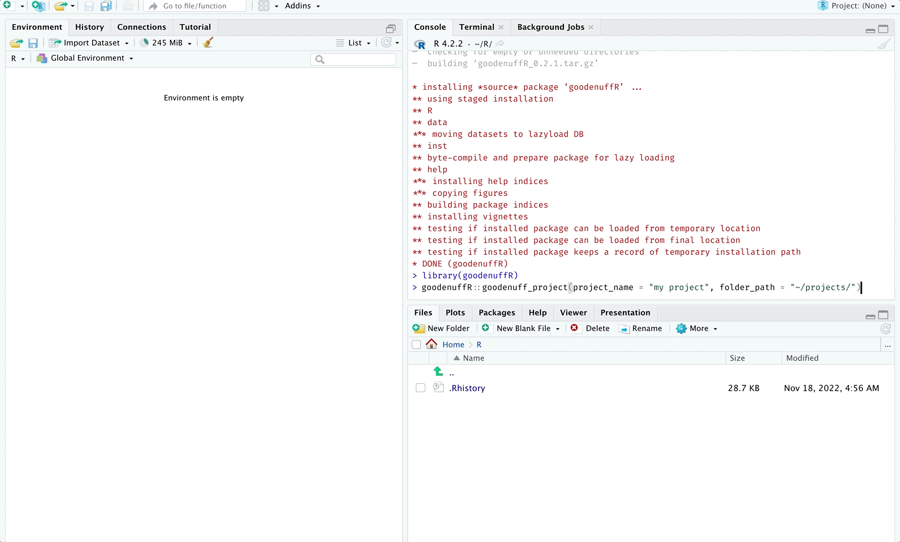

<!-- README.md is generated from README.Rmd. Please edit that file -->

```{r setup, include = FALSE}
knitr::opts_chunk$set(
  collapse = TRUE,
  comment = "#>",
  fig.path = "man/figures/README-",
  out.width = "100%"
)
library(tidyverse)
```


# goodenuffR

```{r goodenuffR.png, echo=FALSE, fig.align='left', out.width = "50%", out.height='50%'}
knitr::include_graphics("man/figures/goodenuffR.png")
```

This `goodenuffR` package is based on the **excellent** advice in the paper, ["Good Enough Practices for Scientific Computing"](https://swcarpentry.github.io/good-enough-practices-in-scientific-computing/) by Wilson et al. 

<!-- badges: start -->
[](https://lifecycle.r-lib.org/articles/stages.html#experimental)
<!-- badges: end -->

The goal of `goodenuffR` is to create the files and folders outlined in the paper above (and like the folder tree below)

```markdown
|-- CITATION
|-- README
|-- LICENSE
|-- requirements.txt
|-- data
|   -- birds_count_table.csv
|-- doc
|   -- notebook.md
|   -- manuscript.md
|   -- changelog.txt
|-- results
|   -- summarized_results.csv
|-- src
|   -- sightings_analysis.py
|   -- runall.py
```

## Installation

You can install the Github version below:

```r
install.packages("devtools")
devtools::install_github("mjfrigaard/goodenuffR")
```

## Quick Start 

```{r goodenuff-setup-gif, echo=FALSE, out.width='100%'}

```

Run this:

```{r quick-start, eval=FALSE}
library(goodenuffR)
goodenuffR::goodenuff_project(
  project_name = "my project", folder_path = "~/projects")
```

Then run this:

```{r goodenuff_files, eval=FALSE}
library(goodenuffR)
goodenuff_files()
```


And you'll see this: 

```
├── CITATION
├── LICENSE
├── README.Rmd
├── code
│   ├── 01-import.R
│   ├── 02-tidy.R
│   ├── 03-wrangle.R
│   ├── 04-visualize.R
│   ├── 05-model.R
│   ├── 06-communicate.R
│   └── runall.R
├── data
│   ├── README.md
│   └── raw
├── docs
│   ├── changelog.txt
│   ├── manuscript.Rmd
│   └── notebook.Rmd
├── my_project.Rproj
├── requirements.txt
└── results
    ├── figures
    ├── manuscript
    └── tables
```


## BONUS: RMarkdown Template

The `goodenuffR` package also comes with a `rmarkdown` template: 

```{r new-rmd.png, echo=FALSE}
knitr::include_graphics("man/figures/new-rmd.png")
```

