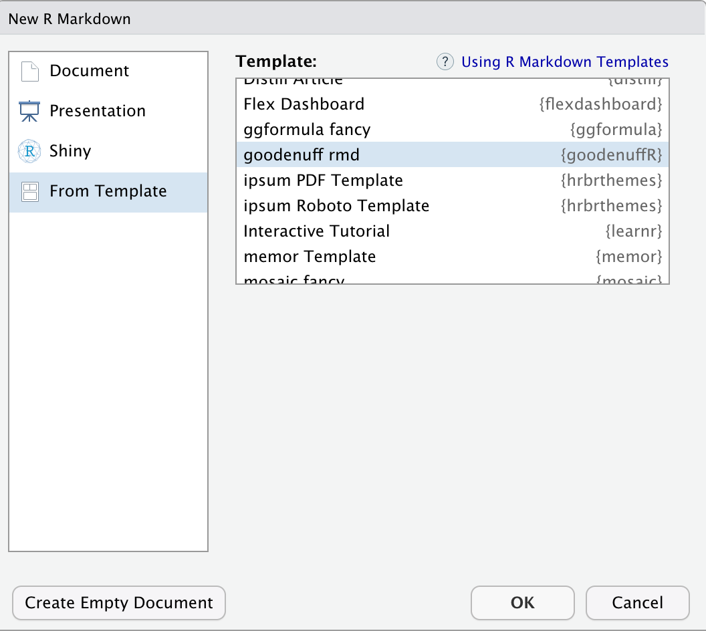

<!-- README.md is generated from README.Rmd. Please edit that file -->

```{r setup, include = FALSE}
knitr::opts_chunk$set(
  collapse = TRUE,
  comment = "#>",
  fig.path = "man/figures/README-",
  out.width = "100%"
)
library(tidyverse)
```


# goodenuffR

```{r goodenuffR.png, echo=FALSE, fig.align='left', out.width = "50%", out.height='50%'}
knitr::include_graphics("img/goodenuffR.png")
```

This `goodenuffR` package is based on the **excellent** advice in the paper, ["Good Enough Practices for Scientific Computing"](https://swcarpentry.github.io/good-enough-practices-in-scientific-computing/) by Wilson et al. 

<!-- badges: start -->
[](https://lifecycle.r-lib.org/articles/stages.html#experimental)
<!-- badges: end -->

The goal of `goodenuffR` is to create the files and folders outlined in the paper above (and like the folder tree below)

```
|-- CITATION
|-- README
|-- LICENSE
|-- requirements.txt
|-- data
|   -- birds_count_table.csv
|-- doc
|   -- notebook.md
|   -- manuscript.md
|   -- changelog.txt
|-- results
|   -- summarized_results.csv
|-- src
|   -- sightings_analysis.py
|   -- runall.py
```

## Installation

You can install the Github version below:

```r
install.packages("devtools")
devtools::install_github("mjfrigaard/goodenuffR")
```

## Quick Start 

Run this:

```{r quick-start, eval=FALSE}
library(goodenuffR)
goodenuffR::goodenuff_project(project_name = "my project", folder_path = "~/projects")
```

Then run this:

```{r goodenuff_files, eval=FALSE}
library(goodenuffR)
goodenuff_files()
```


And you'll see this: 

```{r tree, eval=FALSE}
├── CITATION
├── LICENSE
├── README.Rmd
├── code
│   ├── 01-import.R
│   ├── 02-tidy.R
│   ├── 03-wrangle.R
│   ├── 04-visualize.R
│   ├── 05-model.R
│   ├── 06-communicate.R
│   └── runall.R
├── data
│   ├── README.md
│   └── raw
├── docs
│   ├── changelog.txt
│   ├── manuscript.Rmd
│   └── notebook.Rmd
├── my_project.Rproj
├── requirements.txt
└── results
    ├── figures
    ├── manuscript
    └── tables
```


## Good Enough Code documentation

`goodenuffR::goodenuff_code()` creates code files for various processes. 

```{r goodenuff_code, eval=FALSE}
goodenuffR::goodenuff_code()
# └── code
#    ├── 01-import.R
#    ├── 02-tidy.R
#    ├── 03-wrangle.R
#    ├── 04-visualize.R
#    ├── 05-model.R
#    ├── 06-communicate.R
#    └── runall.R
```

Each `code` file has a header: 

```
#=====================================================================#
# This is code to create:
# Authored by and feedback to:
# MIT License
# Version:
#=====================================================================#
```

## Good Enough Collaboration 

```{r goodenuff_collab, eval=FALSE}
goodenuffR::goodenuff_collab()
# └── CITATION
# └── LICENSE
# └── README.Rmd
# └── requirements.txt
```

This creates `CITATION`, `requirements.txt`, and `LICENSE` files. 

### `CITATION`

```
Make the project citable (3e) by including a CITATION file in the project's 
home directory that describes how to cite this project as a whole, and where 
to find (and how to cite) any data sets, code, figures, and other artifacts 
that have their own DOIs.

Please cite this work as:
Morris, B.D. and E.P. White. 2013. 'The EcoData Retriever:
improving access to existing ecological data.'PLOS ONE 8:e65848.
http://doi.org/doi:10.1371/journal.pone.0065848
```

### `LICENSE` 

This comes from https://creativecommons.org/publicdomain/zero/1.0/legalcode.txt

### README.Rmd

The README.Rmd comes from the excellent example provided by  [`usethis::use_readme_rmd()`](https://usethis.r-lib.org/reference/use_readme_rmd.html). Read more [here](https://r-pkgs.org/whole-game.html#use_readme_rmd)


### `requirements.txt` 

```
# Requirements 


'Make dependencies and requirements explicit. This is usually done on a 
per-project rather than per-program basis, i.e., by adding a file called 
something like requirements.txt to the root directory of the project'


source: https://swcarpentry.github.io/good-enough-practices-in-scientific-computing/
```


## Good Enough Data Storage and Use

Create folder for keeping raw data separate from other data files. 

```{r data-tree, eval=FALSE}
goodenuffR::goodenuff_data()
# data
# ├── README.md
# └── raw
```

The contents of the `data/README.md` file also provide some guidance on storing and documenting data. 

```
# Project Data  

For guidance please see: https://help.osf.io/hc/en-us/articles/360019739054-How-to-Make-a-Data-Dictionary

## Additional Resources

1. Sharing data
http://bit.ly/data-4-sharing

2. Data in spreadsheets
http://bit.ly/data-in-sheets

3. External data (https://r-pkgs.org/)
https://r-pkgs.org/data.html

source: https://swcarpentry.github.io/good-enough-practices-in-scientific-computing/
```


## Good Enough Documentation 

The `goodenuffR::goodenuff_doc()` function creates three files to document your project.

```{r docs-tree, eval=FALSE}
goodenuffR::goodenuff_doc() 
# docs
# ├── changelog.txt
# ├── manuscript.Rmd
# └── notebook.Rmd
```

`notebook.Rmd` is an `html_notebook`, while `manuscript.Rmd` is a `pdf_document` (both written in `rmarkdown`). 

### `notebook.Rmd` 

```
...a running lab notebook describing various ideas for the project and how 
these were implemented


source: https://swcarpentry.github.io/good-enough-practices-in-scientific-computing/
```

### `manuscript.Rmd`

```
....a running draft of a manuscript describing the project findings


source: https://swcarpentry.github.io/good-enough-practices-in-scientific-computing/
```

Read more about rmarkdown [here](https://rmarkdown.rstudio.com/) and [here](https://bookdown.org/yihui/rmarkdown/).

The `changelog.txt` is a plain text file (for 'manual version control').

### `changelog.txt`

```
..make dated notes about changes to the project in this file in reverse 
chronological order (i.e., most recent first). This file is the equivalent of 
a lab notebook, and should contain entries like those shown below.

## 2016-04-08

* Switched to cubic interpolation as default.

* Moved question about family's TB history to end of questionnaire.

## 2016-04-06

* Added option for cubic interpolation.

* Removed question about staph exposure (can be inferred from blood test results).


source: https://swcarpentry.github.io/good-enough-practices-in-scientific-computing/
```


## Good Enough Results 

The following folders are created for your project results:

```{r results-tree, eval=FALSE}
goodenuffR::goodenuff_results()
# results
# ├── figures
# ├── manuscript
# └── tables
```

## BONUS: RMarkdown Template

The `goodenuffR` package also comes with a `rmarkdown` template: 

```{r new-rmd.png, echo=FALSE}

```

